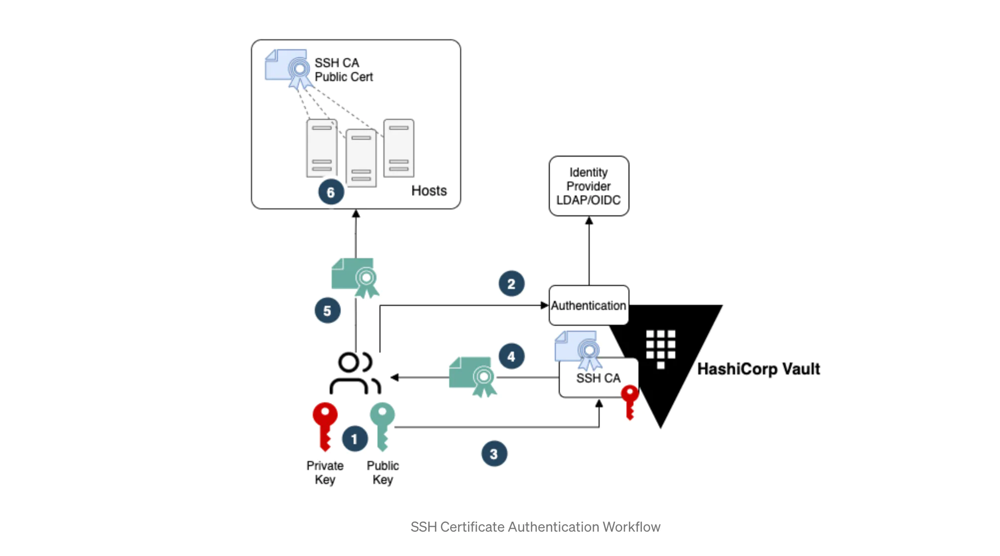

# Managing SSH Access at Scale with HashiCorp Vault

### The Workflow Outline



### Mount UserPass Authentication Method, Create Users, and Attach Policies
```
vault auth enable userpass
 
vault write auth/userpass/users/alice password="passw0rd" policies="administrator-policy"
```

### Mount Vault SSH Certificate Secret Engine and Generate SSH CA Key Pair
```
vault secrets enable -path=ssh-client-signer ssh
 
vault write ssh-client-signer/config/ca generate_signing_key=true
```

### Create Vault Roles for signing client SSH keys
```
vault write ssh-client-signer/roles/administrator-role -<<"EOH"
{
  "algorithm_signer": "rsa-sha2-256",
  "allow_user_certificates": true,
  "allowed_users": "administrator",
  "allowed_extensions": "permit-pty,permit-port-forwarding",
  "default_extensions": {
    "permit-pty": ""
  },
  "key_type": "ca",
  "default_user": "administrator",
  "ttl": "30m0s"
}
EOH
```

### Create Vault Policies
```
vault policy write administrator-policy -<<EOF
path "ssh-client-signer/roles/*" {
 capabilities = ["list"]
}
path "ssh-client-signer/sign/administrator-role" {
 capabilities = ["create","update"]
}
EOF
```

# Host Configurations

### Create Local Users
```
sudo useradd -m admin
sudo useradd -m appadmin
```

### Update Trusted SSH CA Public Key
```
cd /etc/ssh
sudo echo "public-key" > trusted-CA.pem
```

### Create AuthorizedPrincipalsFile File Structure
```
cd /etc/ssh
 
mkdir auth_principals/
 
sudo echo "administrator" > admin
sudo echo "team-a" > appadmin
```

### Update sshd_config Configuration and Restart Service
```
AuthorizedPrincipalsFile /etc/ssh/auth_principals/%u
ChallengeResponseAuthentication no
PasswordAuthentication no
TrustedUserCAKeys /etc/ssh/trusted-CA.pem
```

# Client Configurations

### Create SSH Key Pair
```
ssh-keygen -b 2048 -t rsa -f ~/.ssh/alice-key
ssh-add ~/.ssh/alice-key
```

### Login to Vault
```
vault login -method=userpass username=alice password=passw0rd
```

### Request Signing of User SSH Public Key
```
vault write -field=signed_key ssh-client-signer/sign/administrator-role \
public_key=@$HOME/.ssh/alice-key.pub valid_principals=administrator > ~/.ssh/alice-signed-key.pub

ssh-keygen -Lf ~/.ssh/alice-signed-key.pub
```

### Login with SSH Certificate
```
ssh -i ~/.ssh/alice-signed-key.pub admin@server "whoami"
```